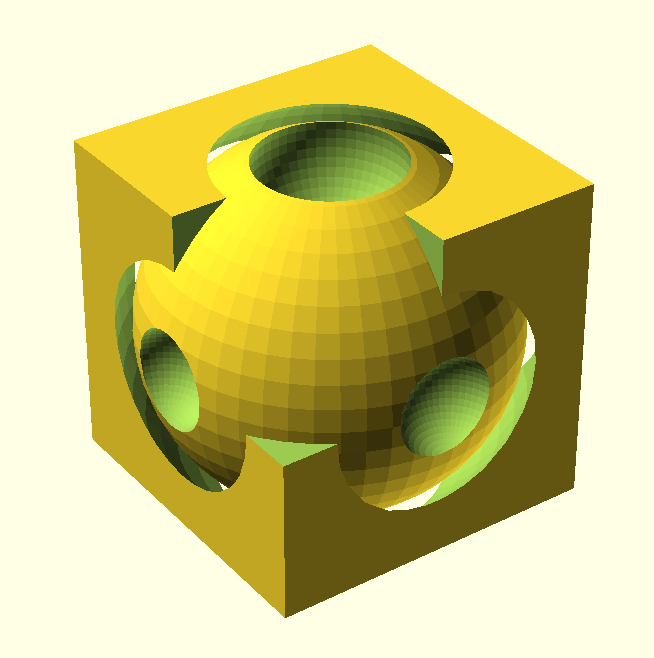

# GOCAD

A simple library for writing [OpenSCAD](https://openscad.org/about.html) code in Go.

## Supported features

Shapes

- sphere
- cube
- cylinder

Transformations

- translate
- rotate
- mirror
- scale

Boolean operations

- union
- difference
- intersection

## Install

run `go get github.com/richi0/gocad`

## Usage

Same as SCAD but with type safety, the ability to chain operations and an easy way to create your own complex shapes.

The following code creates the 3D model below.

```go
package main

import (
	"fmt"
	cad "github.com/richi0/gocad"
)

func main() {
    s := cad.NewSphere(11).Difference(
        cad.NewSphere(3).Translate(0, 0, 8).Scale(1.5, 1.5, 1.5),
        cad.NewSphere(3).Translate(0, 0, -11),
        cad.NewSphere(3).Translate(11, 0, 0),
        cad.NewSphere(3).Translate(-11, 0, 0),
        cad.NewSphere(3).Translate(0, 11, 0),
        cad.NewSphere(3).Translate(0, -11, 0),
    )
    c := cad.NewCube(20, 20, 20).Center().Difference(cad.NewSphere(12), cad.NewCube(20, 20, 20))
    d := cad.NewDocument(s, c)
    fmt.Println(d.Render())
}
```



## Build your own shapes

Creating custom shapes is simple. For example, the `box` shape that is included in this library. `Render` is the only method you need to define. The `NewBox` function is just for convenience.

```go
type Box struct {
	x      float64
	y      float64
	z      float64
	radius float64
	wall   float64
	Shape
}

func (b *Box) Render() string {
	base := NewCube(b.x, b.y, b.z)
	radius := 0.01
	if b.radius != 0 {
		radius = b.radius
	}

	diff := NewRoundedCube(b.x-2*b.wall, b.y-2*b.wall, b.z+radius, radius).Translate(b.wall, b.wall, b.wall)
	res := base.Difference(diff)
	return res.Render()
}

func NewBox(
	x float64,
	y float64,
	z float64,
	radius float64,
	wall float64) *Box {
	b := &Box{x, y, z, radius, wall, CommonMutations{}}
	b.parent = b
	return b
}
```

Then use it like this.

```go
package main

import (
	"fmt"
	cad "github.com/richi0/gocad"
)

func main() {
	b := cad.NewBox(120, 60, 20, 5, 5)
	d := cad.NewDocument(b)
	fmt.Println(d.Render())
}
```


## Extra example

Created shapes can be reused easily. See the following Go code, SCAD code and the 3D-model

```go
package main

import (
	"fmt"

	cad "github.com/richi0/gocad"
)

func main() {
	x := cad.NewSphere(3).Hull(
		cad.NewCube(10, 10, 10).Center().Translate(20, 0, 0),
		cad.NewSphere(3).Translate(40, 0, 0)).Translate(-20, 0, 0)
	y := x.Rotate(0, 0, 90)
	z := x.Rotate(0, 90, 0)
	d := cad.NewDocument(x.Union(y, z))
	d.Fn = 100
	fmt.Println(d.Render())
}
```

```scad
$fn = 100;
union() {
        translate([-20.000000,0.000000,0.000000]) {
                hull() {
                        sphere(3.000000);
                        translate([20.000000,0.000000,0.000000]) {
                                translate([-5.000000,-5.000000,-5.000000]) {
                                        cube([10.000000, 10.000000, 10.000000]);
                                }
                        }
                        translate([40.000000,0.000000,0.000000]) {
                                sphere(3.000000);
                        }
                }
        }
        rotate([0.000000,0.000000,90.000000]) {
                translate([-20.000000,0.000000,0.000000]) {
                        hull() {
                                sphere(3.000000);
                                translate([20.000000,0.000000,0.000000]) {
                                        translate([-5.000000,-5.000000,-5.000000]) {
                                                cube([10.000000, 10.000000, 10.000000]);
                                        }
                                }
                                translate([40.000000,0.000000,0.000000]) {
                                        sphere(3.000000);
                                }
                        }
                }
        }
        rotate([0.000000,90.000000,0.000000]) {
                translate([-20.000000,0.000000,0.000000]) {
                        hull() {
                                sphere(3.000000);
                                translate([20.000000,0.000000,0.000000]) {
                                        translate([-5.000000,-5.000000,-5.000000]) {
                                                cube([10.000000, 10.000000, 10.000000]);
                                        }
                                }
                                translate([40.000000,0.000000,0.000000]) {
                                        sphere(3.000000);
                                }
                        }
                }
        }
}
```


